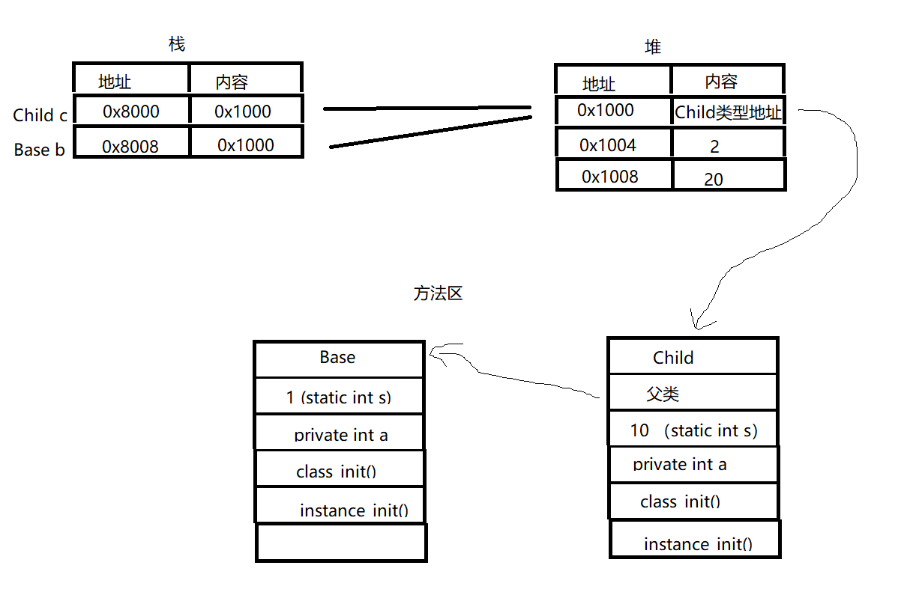

[TOC]


# 第一部分 编程基础

## 第一章 编程基础

### 1.1 数据类型

java数据类型包含 基本数据类型 及 引用类型。基本类型都有其对于的数组类型，数组表示固定长度的同种数据类型的多条记录，这些数据在内存中连续存放。除了基本数据类型，其他都是引用类型。

#### 1.1.1 基本类型

| 基本类型 | 包含                                       |
| -------- | ------------------------------------------ |
| 整数类型 | byte/short/int/long，分别占用1/2/4/8个字节 |
| 小数类型 | float/double ，分别占用4/8个字节           |
| 字符类型 | char 单个字符，占用1个字节                 |
| 真假类型 | boolean                                    |

#### 1.1.2 数组类型

##### 赋值形式

```java
1、 int[] aar = {1,2,3};
2、 int[] aar = new int[3];
3、 int[] aar = new int[3];
	aar[0] = 1;
	aar[1] = 2;
	aar[3] = 3;
```


**数组长度确定之后就不可以变。同时，不能在给定初始值的同时给定长度**。如：

````java
int[] aar = new int[3]{1,2,3};
````


数组类型与基本数据类型对比：

> 数组有两块地址，一块用于存储数组内容本身，另一块存储内容的位置。

| 代码                 | 内存地址        | 内存数据                                              |
| -------------------- | :-------------- | :---------------------------------------------------- |
| int a = 100；        | 1000            | 100                                                   |
| int[] aar = {1,2,3}; | 2000   数组地址 | 3000   存储的是一个位置，3000开始的位置才是实际的数据 |
|                      | 3000            | 1                                                     |
|                      | 3004            | 2                                                     |
|                      | 3008            | 3                                                     |

用两块内存空间原因？

```java
int[] aarA={1,2,3};
int[] aarB={4,5,6,7};
aarA = aarB;
```

如果aarA对应的内存空间是直接存储数组内容，将aarB赋值给aarA时，aarA将没有足够的空间去容纳aarB的所有元素。用两块内存空间时，aarA存储的值就变成和aarB一样，存储的都是数组内容  {4，5，6，7}的地址，此后访问aarA与aarB是一样的，aarA的内存空间将会被垃圾回收。因此，**数组的长度不可变，不可变指的是数组的内容空间，一经分配，长度就不能在变了，可以改变的是数组变量的值。**


### 1.2 基本运算

> 基本数据类型的运算包含：算数运算、比较运算、逻辑运算。

#### 1.2.1 算数运算

| 算数运算                 | 说明                       |
| ------------------------ | -------------------------- |
| 取模 %                   | 数学中的取余数             |
| 自增（++） 和 自减（--） | 对自己进行加一或减一的操作 |


#### 1.2.2 自增与自减

| 算数运算 | 说明                                         |
| -------- | -------------------------------------------- |
| a++      | 先用原来的值进行其他操作，然后在对自己做修改 |
| ++a      | 先对自己做修改，在用修改后的值进行其他操作   |

```java
b = a++ -1;
等价于
b = a - 1;
a = a + 1;
```


#### 1.2.3 逻辑运算

| 逻辑运算符  | 说明                                |
| ----------- | ----------------------------------- |
| 与 &        | 同时为 true 时为 true               |
| 或 \|       | 有一个为 true 时为 true             |
| 非 ！       | true 变为 false                     |
| 异或 ^      | 两个相异为true                      |
| 短路与 &&   | && 前为 false 时，忽略后面的运算    |
| 短路或 \|\| | \|\| 前面为 true 时，忽略后面的运算 |


### 1.3 条件执行

##### 三元运算符

```java
判断条件？ 表达式1： 表达式2；
```


##### switch

```java
// 表达式的值只能是 byte、short、int、char
switch (表达式) {
        case 值1：
            代码1；
            break;
        case 值2；
            代码2；
            break;
    	default:
        	代码 n+1；
}
```


### 1.4 循环

> 循环指多次重复执行某些类似的操作。

| 循环形式 | 语法                                                         | 说明                                                         |
| -------- | ------------------------------------------------------------ | ------------------------------------------------------------ |
| while    | while（conditicon）{ <br /><br />       代码块<br />}        | 条件为true，就一直执行后面的代码                             |
| do/while | do{<br /><br />    代码块<br />}while (condition)            | 不管条件语句是什么，代码块都会至少执行一次，如果条件成立，则继续循环，否则退出循环 |
| for      | for (初始化语句；循环条件； 步进操作) {<br /><br />      循环体<br />} |                                                              |
| foreach  | for (int element: elements){<br /><br />       操作<br />}   | 冒号后面是对数组和集合进行遍历，对于不需要使用索引变量，只是简单遍历的情况，使用更为简洁 |


#### 1.4.1 循环控制

- break

  提前结束循环

- continue

  在循环的过程中，有的代码可能不需要每次循环都执行，这时可通过continue跳出循环体中剩下的代码，继续执行步进操作。


### 1.5 函数

> 使用函数可以减少重复代码和分解负责操作。

##### main函数

```java
public static void main(String[] args){
    ……
}
```

java中的函数放在类中，类可以看作一个容纳函数的容器，即函数放在类中，类中包括多个函数。main函数具有特殊的意义，表示程序的入口，String[] args 表示从控制台接收到的参数，java运行一个程序的时候，会寻找定义的main函数，并从main函数开始执行。

**对于重复的代码，可以定义函数，在需要的地方调用，这样可以减少重复代码。对于复杂的操作，可以将操作分为多个函数，使代码更加易读**。

#### 1.5.1 参数传递

##### 数组

在函数内修改数组中的元素会修改调用者中数组的内容，从**数组长度确定之后就不可以变**可知，数组保存两块内存，一块存储数组内容本身，一块用于存储内容的位置，给数组变量赋值不会影响原有的数组内容本身，而只会**让数组变量指向一个不同的数组内容空间**。

##### 可变长度的参数

当希望参数个数不是固定时，可以在数据类型后面加“ ... ”，在函数内，可变长度参数可以看作是数组，**可变长度参数必须是参数列表的最后一个，一个函数也只能有一个可变长度的参数**。可变长度参数实际上会转化为数组参数，使用可变长度参数主要是简化了代码的书写。

```java
public int sum(int... value){}
```

#### 1.5.2 返回

函数返回值类型为 void 时，也可以使用 return，即 return； ，不用带值，含义是**返回调用方**，只是没有返回值。

函数的返回值最多只有一个，实际情况中，需要返回多个返回值时：

1. 计算一个整数数组中最大的前三个数，需要返回三个结果，可用数组作为返回值。
2. 当需要返回一个复合结果时，如查找一个数组中所有重复出现的字符及出现的次数，可以用对象作为返回值。

#### 1.5.3 重复的命名

每一个函数都有一个名字，这个名字表示这个函数的意义。同一个类中，函数可以重名，但是参数个数不能完全一样，即**要么参数个数不同，要么参数个数相同但是参数类型不一样**。这种被称为**函数重载**。


### 1.6 函数调用

#### 1.6.1 栈

程序执行基本原理：CPU 有一个指令指示器， 指向下一个要执行的指令，要么顺序执行，要么进行跳转（条件跳转或无条件跳转）。

程序从main函数开始顺序执行，函数调用可以看作一个无条件跳转，跳转到对应函数的指令处开始执行，碰到 return 语句或者函数结尾的时候，在执行一次无条件跳转，跳转回调用方，执行调用函数后的下一条指令。

存放数据的内存的地方为 栈，栈是一块内存，栈一般是先进后出，类似于一个桶，往栈中放数据为入栈，最下面的底为栈底，最上面的为栈顶，从栈顶拿出数据通常称为出栈。栈一般是从高位地址向低位地址拓展，换句话说，栈底的内存是最高的，栈顶的是最低的。

计算机主要使用栈来存放函数调用过程中需要的数据，包括参数，返回地址，以及函数定义的局部变量。**main函数的相关数据放在栈的最下面，每调用一次函数，都会将相关函数的数据入栈，调用结束会出栈**。

- 函数中的基本数据类型（参数和函数定义的变量），在函数被调用时才分配，在调用结束后就被释放了。
- 对于数组和引用类型，均有两块内存，一块存放实际的内容，一块存放实际内容的地址，实际内容一般不是分配在栈上的，而是分配在堆（也是内存的一部分）中，但是存放地址的空间是分配在栈上的。堆 由地址和内容组成。对于数组，存放地址的栈空间会随着入栈分配，出栈释放，但实际内容的堆空间不受影响。


# 第二部分 面向对象

## 第二章 类的基础

### 2.1 对象

对象是由基本数据类型、数组和其他对象组合而成的一个东西，以方便对其整体进行操作。为了操作数据，需要把数据放在内存中。内存在程序看来就是一块有**地址编号**的**连续**的空间，CPU对加载的变量的值进行各种运算，运算后的结果又可以赋值给其他变量，保存到内存中。


#### 2.1.1 类

> 通过private 封装和隐藏内部实现细节，避免误操作，是计算机程序的一种基本思维

##### Math常用函数

| 函数                            | 功能     | 函数                  | 功能                           |
| ------------------------------- | -------- | --------------------- | ------------------------------ |
| int round (float a )            | 四舍五入 | int abs(int a)        | 绝对值                         |
| double sqrt( double a)          | 平方根   | int max(int a, int b) | 最大值                         |
| double ceil (double a)          | 向上取整 | double log(double a)  | 自然对数                       |
| double floor (double a)         | 向下取整 | double random()       | 产生一个大于等于0小于1的随机数 |
| double pow (double a, double b) | a的b次方 |                       |                                |

##### Arrays常用函数

| 函数                                         | 功能                     |
| -------------------------------------------- | ------------------------ |
| void sort(int[] a)                           | 排序，按升序排           |
| int binarySearch( long[] a, long key)        | 二分查找，数组按升序排列 |
| void fill (int[] a , int val)                | 给所有数组元素赋相同值   |
| int[] copyOf( int[] priginal, int newLength) | 数组复制                 |
| boolean equals(char[] a, char[] b)           | 判断两个数组是否相同     |


#### 2.1.2 自定义数据类型

自定义数据类型是指除了八种基本类型以外的其他类型，用于表示和处理基本类型以外的其他数据。**一个数据类型由其包含的属性以及该类型可以进行的操作组成**，属性又可以分为是类型本身具有的属性，还是一个具体实例具有的属性，同样，操作也可以分为是类型本身可以进行的操作，还是一个具体实例可以进行的操作。因此，一个数据类型由以下部分组成：

- 类型本身具有的属性，通过**类变量**（经常用于表示一个类型中的常量）体现。
- 类型本身可以进行的操作，通过**类方法**体现。
- 类型实例具有的属性，通过**实例变量**体现。
- 类型实例可以进行的操作，通过**实例方法**体现。

类变量 与 实例变量 都叫 **成员变量**，类方法和实例方法都叫**成员方法**。

> final在修饰变量的时候常量，即变量赋值之后就不能在修改了。


#### 2.1.3 初始化代码块

实例变量都有一个默认值，可以在定义变量时就赋值，或将代码放入初始化代码块 {} 中。

静态初始化代码块在类加载的时候执行，这时在任何对象创建之前，且只执行一次。


#### 2.1.4 类和对象的生命周期

```java
Base b = new Base();

Base b;       	声明一个变量，变量叫b，类型是Base
b = new Base();	分配内存创建一个实例，然后赋值给变量b，并给实例变量赋默认值

```


1. 在程序运行时，当第一次通过 new 创建一个类的对象时，或者直接通过类名访问类变量和类方法时，java会将类加载进内存，为这个类分配一块空间，这个空间包含类的定义、变量和方法信息，同时还有类的静态变量，并对静态变量赋初始值。
2. 类加载进内存后，一般不会释放，知道程序结束。一般情况下，**类只会加载一次，所有静态变量在内存中只有一份**，**多个实例的 static变量会共享同一块内存区域**。
3. 当通过 new 创建一个对象时，在内存中，会存储这个对象的实例变量值，每 new 一次，就会产生一个对象，就会有一份独立的实例变量。每个对象除了保存实例变量的值外，还可以理解为还保存着对应类型即类的地址，这样就能通过对象知道它的类，访问到类的变量和方法代码。当对象不在被使用时，就会被垃圾回收机制自动释放。

> 具体来说就是：对象和数组一样，有两块内存，保存地址的部分分配在栈中，而保存实际内容的部分分配在堆中。栈中的内存是自动管理的，函数调用入栈就会分配，出栈就会释放。
>
> 堆中的内存是被垃圾回收机制管理的，当没有**活跃变量**指向对象的时候，对应的堆空间就可能会释放，具体释放时间是java虚拟机自己决定的。 **活跃变量**指已加载的类的变量，以及栈中的所有变量。


#### 2.1.5 类的组合

对于一个线来说，是由点组成。**每个类封装其内部细节，对外提供高层次的功能，使其他类在更高层次上考虑和解决问题，使程序设计的一种基本思维**。想想现实问题有那些概念，这些概念有哪些属性，哪些行为，概念之间有什么关系，然后定义类、定义属性、定义方法、定义类之间的关系。概念的属性和行为可能是非常多的，但定义的类只需要包括那些与现实问题有关的就行了。

**分解显示问题中设计的概念以及概念间的关系，将概念表示为多个类，通过类之间的组合表达更为复杂的概念以及概念间的关系**。


#### 2.1.6 封装

**通过对象来访问和操作其内部的数据**是一种基本的面向对象思维。一般而言，不应该将实例变量声明为public，而只应该通过对象的方法对实例变量进行操作。这样可以减少误操作，直接访问变量**没有办法进行参数检查和控制，而通过方法的修改，可以在方法中进行检查**。


#### 2.1.7 包

包有包名，这个名称以点号分隔表示层次结构。带完整包名的类名称称为其**完全限定名**，如String类的完全限定名为 java.lang.String （java是上层包名，lang是下层包名，位于包java.lang下）。java中所有的类和接口都位于 java 或 javax下，java是标准包， javax是拓展包。

如果类不在同一个包内，则必须知道其所在的包。使用方式：一种是通过类的全限定名，另外一种是将用到的类引入当前类。例外是，java.lang 下的类可以直接使用，其他包内的则不行。

通过 import java.util.* 不会引入嵌套包内的类，只会引入该包下的直接类。有一种特殊的导入，称为静态导入，它有一个 static 关键字，可以直接导入类的公共静态方法和成员。

包范围可见性：同一个包指的是同一个直接包，子包下类并不能访问。protected 可见性包括包可见性，也就是说，**声明为protected不仅表明子类可以访问**，还表明同一个包内的其他类可以访问，即使这些类不是子类也可以。可见性范围从小到大是： **private < 默认（包）< protected < public**。


#### 2.1.8 程序的编译与链接

编译时将源代码文件变成拓展名是 .class 的字节码，这个工作一般是由 javac 命令完成的。

链接是在运行时动态执行的， .class文件不能直接运行，运行的是java虚拟机，虚拟机执行的是 java 命令，这个命令解析 .class 文件，转换为机器能识别的二进制代码，然后运行。所谓链接就是根据引用到的类加载相应的字节码并执行。

java 编译和运行时，都需要指定一个 classpath，即类路径。类路径有多个，对于直接的 class 文件，路径是 class 文件的根目录；对于 jar 包（一种压缩文件），路径是 jar 包的完整名称（包括路径和 jar 包名）。在java 源代码编译时，java编译器会确定引用的每个类的完全限定名，确定的方式是 import 语句和 classpath。如果导入的是完全限定类名，则可以直接比较并确定。如果是模糊导入 （import 带 .*），则根据 classpath找到对应父包，再在父包下寻找是否有对应的类。

java 运行时，会根据类的完全限定名寻找并加载类，寻找的方式就是在类路径中寻找，如果是 class 文件的根目录，则直接查看是否有对应的子目录及文件，如果是 jar 文件，则首先在内存中解析文件，然后在查看是否有对应的类。总结来说就是：**import是编译时概念，用于确定完全限定名，在运行时，只根据完全限定名寻找并加载类，编译和运行时都依赖类路径，类路径中的jar文件会被解压缩用于寻找和加载类。**


## 第三章 类的继承

> 现实中有一种非常重要的概念，就是分类。分类有个根，然后向下不断细化，形成一个层次分类体系。如：动物有不同的科目，食肉动物，食草动物等，食肉动物又有狼、虎等，这些又细分为不同的种类。计算机中使用类之间的**继承关系**来表示对象之间的分类关系。
>

### 3.1 根父类 Object

Object 对象的 toSring 方法的目的是**返回一个对象的文本描述**，这个方法可以直接被所有类使用。

```java
public String toString(){
    return getClass().getName() + "@" + Integer.toHexString(hashCode());
}
```

@ 后返回一个 hashcode 的整数值，这个整数值通常是内存的地址值 ，因为Object类并不知道对象的属性，不知道怎么用文本描述，但又需要区分不同的对象，只能描述写一个hash值 ，但子类是知道自己的属性的，所以子类是可以重写父类的方法的，以反映自己的不同实现。

### 3.2 继承

#### 3.2.1 定义

子类继承父类的属性和行为，父类有的属性和行为子类都有，但子类可以增加子类特有的属性和行为，某些父类的行为，子类的实现方式可能与父类不完全一样。


#### 3.2.2 继承使用

- 一个类只能有一个父类
- 子类不能访问父类的私有的属性和方法，除了私有的，子类继承了父类的其他属性和方法
- super 关键字用于指定父类，可用于调用父类构造器，父类方法和变量。**调用父类构造方法时，super必须放在第一行**。用于告诉编译器访问父类的相关变量和方法。如果子类没有通过super调用，则会自动调用父类的默认构造方法，如果父类没有默认的构造方法，有有参的构造方法，则任何子类都必须通过super调用父类的带参的构造方法
- protected 表示不能被外部任意访问，但是可以被子类访问。还表示可以被同一个包中的其他类访问。通过 protected 关键字，子类可以修改 protected 定义的方法或变量，从而修改对外的行为（即模板方法）。
- 重写方法时，子类方法不能降低父类方法的可见性。继承反映的是 “is-a”的关系，即子类对象也属于父类，子类必须支持父类所有的对外行为，将可见性降低就会减少子类对外的行为，从而破坏 “is-a”的关系，但子类可以增加父类的行为，所以提升可见性是没有问题的。
- 不希望父类或父类方法或类被子类重写和继承，可以通过final实现。


#### 3.2.3 向上转型与向下转型

子类对象赋值给父类引用变量，这是**向上转型**。转型就是转换类型，向上转型就是转换为父类类型。父类可以引用任何父类的子类类型，这叫**多态**（即一种类型的变量，可以引用多种实际类型对象）。多态使得**操作对象的程序不需要关注对象的实际类型，从而可以统一处理不同对象，但又能实现每个对象的特有行为**。

向下转型：父类型的变量赋值给子类型的变量。


一个父类的变量能不能转换为一个子类的变量，取决于这个父类变量的动态类型（即引用的对象类型）是不是这个子类或这个子类的子类

```java
Base b = new Child();
Child c = (Child) b;

//抛出类型转换错误
Base b = new Base();
Child c = (Child) b;
```

通过 instanceof 判断一个父类的变量是不是某个子类的变量。

### 3.3 继承实现基本原理

#### 3.3.1 类加载过程

类的加载是指将类的相关信息加载到内存中。在java中，类是动态加载的，当第一次使用这个类的时候才会加载，加载一个类时，会查看其父类是否已加载，如果没有，则会加载其父类。

类信息包括以下部分：

- 类变量（静态变量）
- 类初始化代码 （定义静态变量时的赋值语句、静态初始化代码块）
- 类方法（静态方法）
- 实例变量
- 实例初始化代码 （定义实例变量时的赋值语句、实例初始化代码块、构造方法）
- 实例方法


类加载过程：

1. 分配内存保存类的信息
2. 给类变量赋默认值
3. 加载父类
4. 设置父子关系
5. 执行类初始化代码 （先执行父类的，在执行子类的）


**内存分为栈和堆，栈存放函数的局部变量，而堆内存存放动态分配的对象，还有一个内存区，存放类的信息，这个区在java中称为 方法区**。加载后，java 方法区就有了一份类的信息。


#### 3.3.2 对象创建过程

类加载之后，就是创建对象，创建对象过程包括：

1. 分配内存 （包括本类和所有父类的实例变量，但不包括任何静态变量）
2. 对所有实例变量赋默认值
3. 执行实例初始化代码 （实例初始化代码的执行从父类开始，在执行子类）

**每个对象除了保存类的实例变量之外，还保存着实际类信息的引用**。

````java
Child c = new Child();
````




### 3.4 继承是把双刃剑

> 一方面继承是非常强大的， 另一方面继承的破坏力也是很强的。
>
> 继承破坏力表现在：继承可能破坏封装，而封装可以说是程序设计的第一原则；另一方面，继承可能没有反映出 “is-a” 关系

3.4.1 继承破坏封装

**封装就是隐藏实现细节，提供简化接口。使用者只需要关心怎么用，不需要关注内部是如何实现。实现细节可以随时修改，而不影响使用者。函数是封装，类也是封装。**通过封装，可以在更高层次上考虑和解决问题。没有封装，代码之间会到处存在实现细节的依赖，构建复维护复杂的的程序是难以想象的。

继承可能破坏封装是因为**子类和父类之间可能存在着实现细节的依赖**，子类在继承父类的时候，往往不得不关注父类的实现细节，而父类在修改其内部实现的时候，如果不考虑子类，往往会影响到子类。如果子类不知道基类方法的实现细节就不能正确地进行拓展。

**父类和子类之间是细节依赖，子类拓展父类，仅仅知道父类父类能做什么是不够的，还需要知道父类是怎么做的，而父类的实现细节也不能随意修改，否则可能影响子类**。

因此，**父类不能随意增加公开方法，因为给父类增加就是给所有子类增加，而子类可能必要要重写该方法才能确保方法方法的正确性**。


### 3.5 如何应对继承的双面性

1. 避免使用继承
2. 正确使用继承


#### 3.5.1 避免使用继承

- 使用final关键字

  给方法加final修饰符，父类就保留了随意修改这个方法内部实现的自由，使用这个方法的程序也可以确保其行为是符合父类声明的。给类加final修饰符，父类就保留了随意修改这个类实现的自由。

  

- 有限使用组合而非继承

  使用组合可以抵挡父类变化对子类的影响，从而保护子类，应该优先使用组合。但组合的问题是，子类对象不能当作基类对象来统一处理，解决方法是使用接口。

  

- 使用接口

  

#### 3.5.2 正确使用继承

1. 基类是别人写的，我们写子类

   重写方法不要改变预期的行为

   阅读文档说明，理解可重写方法的实现机制，尤其是方法之间的依赖

   在基类修改的情况下，阅读其修改说明，相应修改子类。

   

2. 我们写基类，别人可能写子类

   使用继承能正确反映 is-a 的关系，只将真正公共的部分放到基类

   对不希望被重写的公开方法添加final修饰符

   写文档，说明可重写方法的实现机制，为子类提供指导，告诉子类该i如何重写。

   在基类修改可能影响子类时，写修改说明。

   

3. 基类、子类都是我们写的

   


### 3.6 作用

一方面可以**复用代码**，公共的属性和行为可以放到父类中，而子类只需要关注子类特有的就可以了；另一方面，**不同子类的对象可更为方便的被统一处理**。


## 第四章 类的拓展


## 第五章 异常


## 第六章 常用基础类

### 6.1 各种包装类

包装类：内部有一个实例变量，保存对应的基本类型的值。内部有一些静态方法和实例方法，方便对数据操作。

装箱：将基本类型转换为包装类的过程

拆箱：将包装类型转换为基本类型的过程


6.1.1 共同点

1. equals

   equals 用于判断当前传入的对象是否相同。所有包装类都重写了该实现，实际比较用的是其包装类的基本类型值。

2. hashcode

   hashcode 返回一个对象的哈希值，是一个int类型的数，由对象中一般不变的属性映射的来，用于快速区分对象。hashcode 默认实现是将对象的内存地址转化为整数。子类如果重写equals方法，也必须重写hashCode。

3. Comparable

   在小于、等于、大于参数时。分别返回 -1、0、1

4. 包装类和String

   每个包装类都有一个 valueOf（String） 方法，根据字符串表示返回包装类对象，

   静态 parseXXX（String）方法，根据字符串表示返回基本类型值。

5. Number

   6中数值类型包装类有一个共同的父类，Number是一个抽象类，通过其中定义的方法， 包装类实例可以返回任意的基本数值类型。

6. 不可变性

   包装类都是不可变类

   - 所有包装类都被声明为 final ，不能被继承
   - 内部基本类型值都是私有的，且声明为了 final
   - 没有定义setter 方法

   

### 6.2 String 和 StringBuilder


### 6.3 Arrays


### 6.4 日期和时间处理


### 6.5 随机


# 第三部分 泛型与容器

## 第七章 泛型


## 第八章 列表和队列


## 第九章 Map 和 Set


## 第十章 堆与优先级队列


## 第十一章 通用容器类和总结


# 第四部分 文件


## 第十二章 文件基本技术


## 第十三章 文件高级技术

### 13.1 常见文件类型处理

#### 13.1.1 Excel 

使用POI类库处理Excel文件，接入方式：

```groovy
dependencies{
	implementation "org.apache.poi:poi-excelant:4.1.0"
}
```

##### 创建 sheet

XSSFWorkbook类：可以对对Excel进行读写，它兼容.xls和.xlsx格式，支持office的2007或者更高版本，
HSSFWorkbook类：可以对对Excel进行读写，它兼容.xls格式，不支持高版本的office
所以一般我们会使用XSSFWorkbook来操作表格，看看如何向单元格里保存数据。


```java
public class ExcelFile {
    public static final String PATH = "out\\WriteSheet.xlsx";

    private final String mFilePath;
    private final XSSFWorkbook mWorkbook;
    private final XSSFSheet mSheet;
    private int rowNum = 0;

    public ExcelFile(String filePath) {
        mFilePath = filePath;
        mWorkbook = new XSSFWorkbook();
        mSheet = mWorkbook.createSheet();
    }

    public void setTableTitle(String... names) {
        XSSFRow row = mSheet.createRow(rowNum++);
        for (int i = 0; i < names.length; i++) {
            XSSFCell cell = row.createCell(i);
            cell.setCellValue(names[i]);
        }
    }

    public void setContent(String... contents) {
        XSSFRow row = mSheet.createRow(rowNum++);
        for (int i = 0; i < contents.length; i++) {
            XSSFCell cell = row.createCell(i, CellType.STRING);
            cell.setCellValue(contents[i]);
        }
    }

    public void create() {
        try (FileOutputStream fos = new FileOutputStream(mFilePath)) {
            mWorkbook.write(fos);
            mWorkbook.close();
        } catch (IOException e) {
            e.printStackTrace();
        }
    }
}
```


##### 读取 sheet


##### 参考

https://juejin.cn/post/6944188146796118052

https://juejin.cn/post/6844903505501618190


#### 13.1.2 HTML

介绍 jsoup HTML分析器，接入方式：

```groovy
dependencies{
 	implementation 'org.jsoup:jsoup:1.11.3'   
}
```


#### 13.1.3 CSV


#### 13.1.4 属性文件


#### 13.1.5 压缩文件


#### 13.1.6 XML

使用 DOM4J 库，接入方式：

```groovy
dependencies{
    implementation group: 'org.dom4j', name: 'dom4j', version: '2.1.1'
}
```


### 13.2 随机读写文件


### 13.3 内存映射文件


### 13.4 标准序列化机制


### 13.5 使用 Jackson 序列化为 JSON/XML/MessagePack


# 第五部分 并发

## 第十四章 并发基础知识


## 第十五章 并发包的基石


## 第十六章 并发容器


## 第十七章 异步任务执行服务


## 第十八章 同步和协作工具类


## 第十九章 并发总结


# 第六部分 动态与函数式编程

##  第二十章 注解与反射

> 使用声明式编程，为应用程序员提供更高级的语言，使程序员可以在更高的抽象层次上思考和解决问题，不是陷于底层的实现细节。
>
> 注解可以提升java语言的表达能力，有效实现应用功能和底层功能的分离，框架/库的程序员可以专注于底层的实现，借助反射实现通用功能，提供注解给应用程序员使用，应用程序员可以专注于应用功能，通过简单的声明式注解与框架/库进行协作。

### 6.1 常用注解

| 注解             | 说明                                                         |
| ---------------- | ------------------------------------------------------------ |
| @Override        | 表示该方法不是当前类首先声明，是在某个父类或实现的接口中声明的 |
| @Deprecated      | 表示对应的代码已经过时，不应该使用它                         |
| @SuppressWarning | 表示压制java的编译警告                                       |

### 6.2 自定义注解

| 元注解     | 注解参数                                                     |
| ---------- | ------------------------------------------------------------ |
| @Target    | Element.TYPE、Element、Method ...                            |
| @Retention | RetentionPolicy.SOURCE, RetentionPolicy.CLASS, RetentionPolicy.RUNTIME |
| @InHerited | 表示继承                                                     |

注解内参数合法类型：基本类型、String、Class、枚举、注解以及这些类型的数组。

#### 查看注解信息

| 方法                   | 说明                                                  |
| ---------------------- | ----------------------------------------------------- |
| getAnnotations         | 获取所有注解                                          |
| getDeclaredAnnotations | 获取所有本元素上直接声明的注解，忽略inHerited来的注解 |
| getAnnotation          | 获取指定类型注解，没有返回 null                       |
| isAnnotationPresent    | 是否有指定注解                                        |


实际上，内部实现时，所有的注解类型都是拓展的 Annotation。Annotation是一个接口，它表示注解

```
public interface Annotation {
	boolean equals (Object obj);
	int hashCode();
	String toString();
	// 返回真正的注解类型
	Class<? extends Annotation> annotationType();
}
```


对于Constructor和Method，他们都有方法参数，而参数也可以有注解，他们均有如下方法：

```java
public Annotation[][] getParameterAnnotations();
```


### 6.3 反射


### 6.4 注解处理器


### 6.5 依赖注入容器


## 第二十一章 动态代理


## 第二十二章 类加载机制


## 第二十三章 正则表达式


## 第二十四章 函数式编程


# 第七部分 进阶

## 第二十五章 Junit 单元测试

### 5.1 测试分类

黑盒测试：给代码给定输入部分参数，代码执行之后能否得到预期的结果。不需要写代码，俗称 ”点点点“

白盒测试：需要写代码，关注程序具体的执行流程。

### 5.2 Junit使用

步骤：

1. 定义测试类（测试用例） 测试类类名格式：测试类+Test 、 包名：xxx.xxx.xxx.test
2. 定义测试方法：可以独立运行  方法名：test+测试方法名 、 返回值：void、参数列表：无参
3. 给方法加注解@Test


##### 常用注解

| 注解    | 说明                                                         |
| ------- | ------------------------------------------------------------ |
| @Before | 所有的测试方法在执行之前均会调用@Before注解的方法执行该方法，用于资源申请及初始化操作。 |
| @After  | 在所有方法测试完成后，都会执行@After注解的方法，用于释放资源 |

#### 5.2.1 基本测试

```java
@Test
public void testAdd() {
    //todo test
}
```


#### 5.2.2 参数化测试

```java
@Test
public void testAdd(){
    
}
```


#### 5.2.3 异常测试


### 